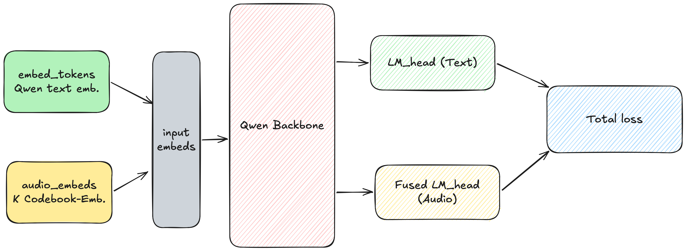

# Audio Language Model
## News
>[!Info]
>This repo is associated with the Neural Networks software project (WiSe2025/26) by Prof. Dr. Dietrich Klakow.

## Architecture


## Usage

### Training
Run the training script with your desired configuration:
```bash
bash train.sh \
    --tokenizer_path  \
    --dataset_path  \
    --checkpoint_dir  \
    --batch_size  \
    --num_epochs  \
    --lr 
```

### Data Downloading & Preprocessing
Preprocess ASR/TTS data (English or German):
```bash
bash scripts/preprocess_asr.sh
```

Preprocess S2ST data:
```bash
bash scripts/preprocess_s2st.sh
```
Preprocess T2T data:
```bash
bash scripts/generate_t2t.sh

All preprocessed datasets follow the same format and are concatenated 
and shuffled before training.


